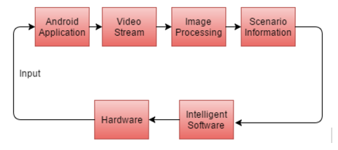
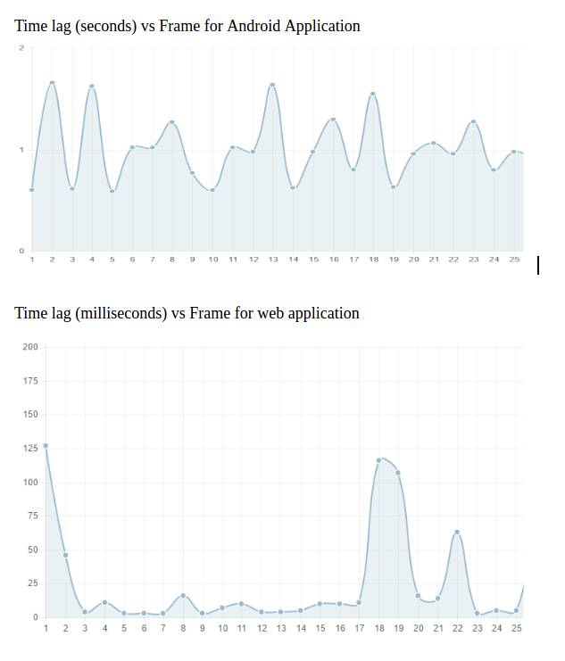
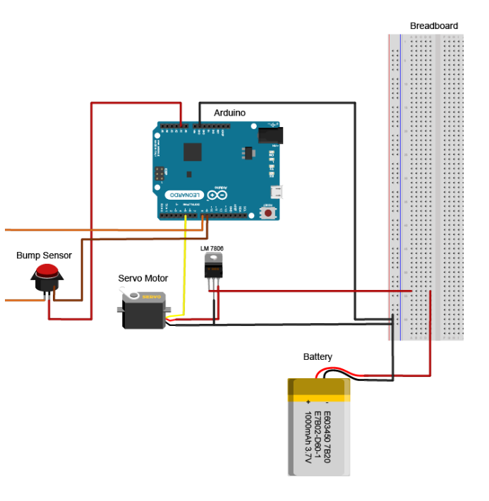
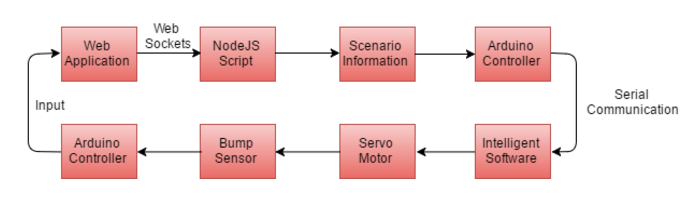

# FlappyBird Automation using Servo

Flappy Bird Automation using Reinforcement Learning to play automatically using servo motor

## Abstract

Games have been a part of human entertainment since the wild age. People use games for refreshment and socialization. Thus, as a step towards becoming human like, ability to play any kind of games by robots is an essentiality.  Thus, to enable machines to play games through software intelligence, we aimed to create an architecture which would help us implement artificial intelligence on hardware components.

These hardware components will imitate real humans and take information that real humans will get for making a decision. Using this information, intelligence will perform some calculations to make optimal decisions.

We have used flappy bird game as a sample in this project for creating the desired architecture.

## Choosing a platform

We initially chose web application as our major platform for testing due to simplicity of retrieving scenario information from it. Our state space consisting of horizontal distance from the pipes and vertical distance from the lower pipe was easy to implement, retrieve and analyze in the web applications.

Flappy Bird could also be implemented in Android but retrieval of information about scenario is relatively complex and slow for intelligence software prototyping and training. Since, there is no direct way of taking state information from Android, we took a video stream of the game and applied image processing to get both the state space coordinates. This process due to streaming and processing took a lot of time to execute and return the coordinates and by the time it did, the bird was already dead.

So for the aim of training initially and then playing, we chose the web application. The learning gained from playing web application can be applied later via streaming to Android application.

## Q Learning State Space

State Space: “horizontal distance x vertical distance x number of actions”

Actions: "Click" & "Do nothing"

Formula:

```
Q(s,a) = (1-α)Q(s,a) + α(r + γ max(Q(s',a')))
```

## Complications

- Time lag: Take a fast servo motor and play on a local server for faster websocket interactions
- Tapping Mechanism: Use a bump sensor for immediate input from servo motor
- Memory limits and consumption: Fixed by using canvas repainting and dumping

## Getting state information from android device

Following image shows the process used to get space state information from an android device which turns out to be very slow overall



## Time lag gap in android and web




| Web Application | Mobile Application |
| --------------- | ------------------ |
| 	87.4ms        |     332.2ms        |

## Microcontroller and Johnny Five

We used Arduino Uno and Johnny Five to run the servo motor, provide action and return feedback.
Code for this can be found in this project

## Circuit Diagram



## Final Architecture

Following architecture can be used to create and train software to play any kind of games which can be played by a human using his arm




- Scenario information from web application to node.js script - via websockets
- Node.js script to arduino controller - via serial communication
- Arduino to servo motor - via electrical signals
- Servo motor to bump sensor  - via touch
- Bump sensor to arduino - via electrical signals
- Arduino to node.js script - via serial communications
- Node.js script to Web application - via Websockets


## Contributors

Akshay Deshraj (@axay)
Amit Kumar Mehar (@amuTBKT)

## Further information

If anyone needs further information about the project, they can contact me,
